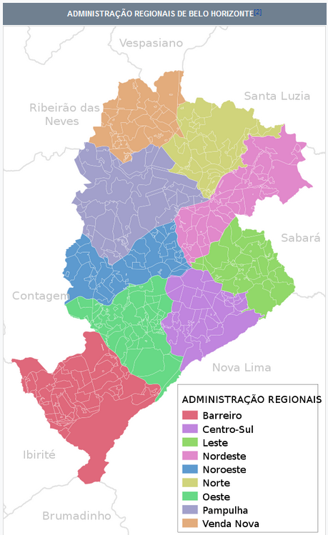
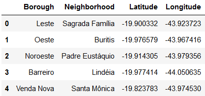
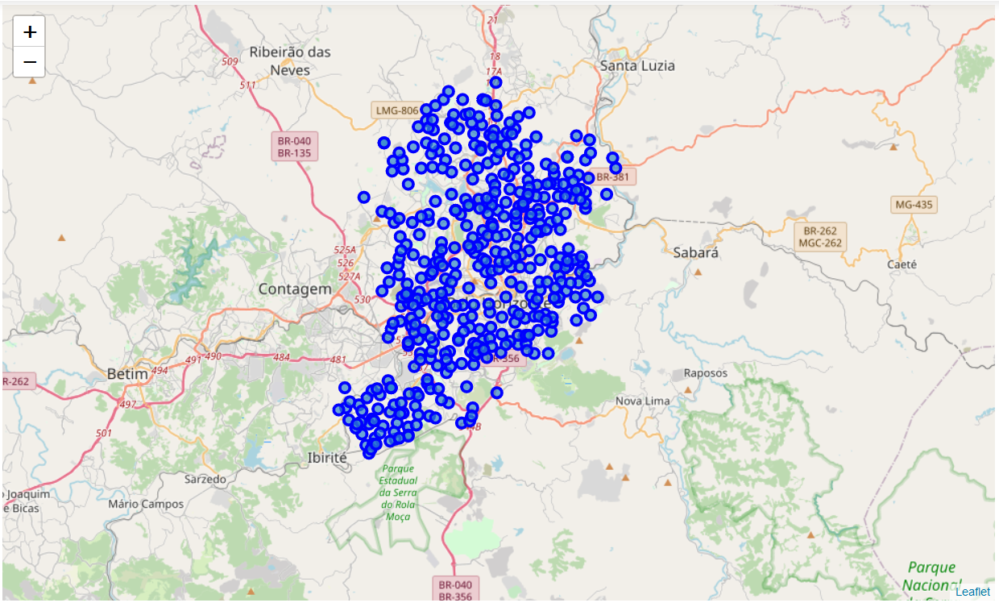
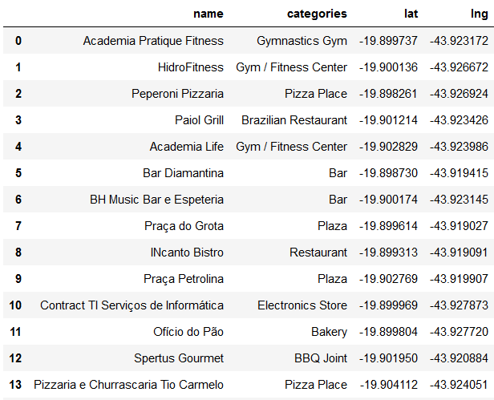
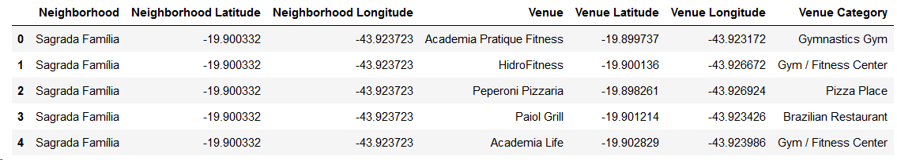
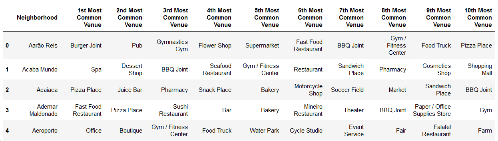
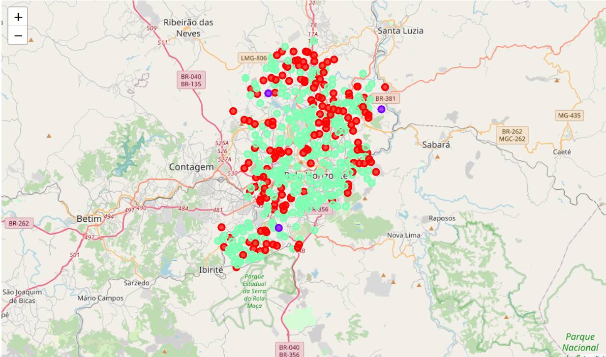
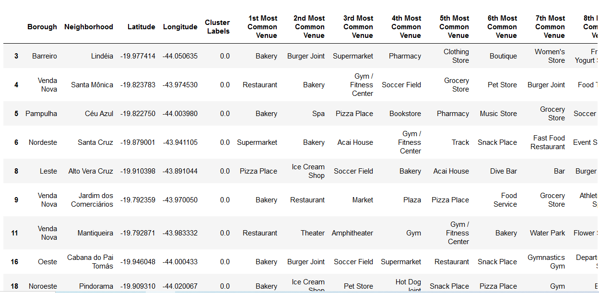
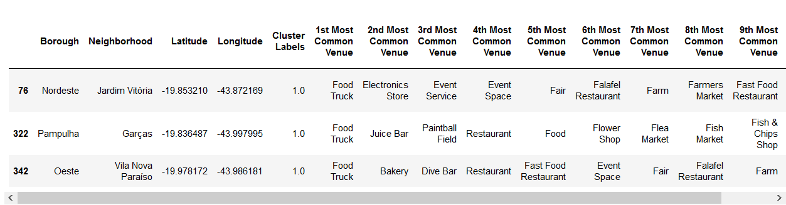
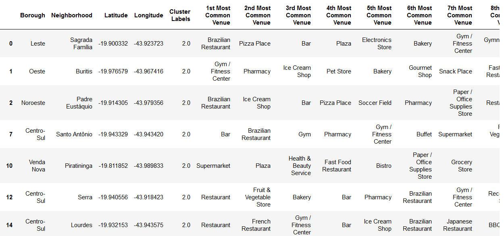

# Coursera Capstone Project - The Battle of Neighborhoods

# Introduction
The Goal of this study is to enable a restaurant chain to plan their investiment and open new restaurants in my city, Belo Horizonte - Minas Gerais - Brazil. Belo Horizonte is the capital of the state and one of the most populated cities in Brazil, having a population of 2,5 million people in the city, but almost 5 million when adding population from the nearby cities. However, the city is formed by different types of neighborhoods in which rich and poor people live. This way, it is important to evaluate the characteristics of these neighborhoods to determine in which one should they open their first restaurant.

# Data
The data regarding the list of neighborhoods and their respective boroughs will be extracted from https://pt.wikipedia.org/wiki/Lista_de_bairros_de_Belo_Horizonte, see below the map of boroughs in Belo Horizonte.

Then, I'll extract geographical coordinates for each neighborhood usigin Geopy API and then get the venues of each neighborhood with Foursquare API.

# Methodology
First I gathered the list of all neighborhoods of Belo Horizonte at WikiPedia and used GeoPy to get latitude and longitude for each neighborhood to have a dataframe as below.

Next step was visualizing all neighborhoods in a map, so I used Folium to add markers for each neighborhood thorugh it's coordinates and generate the map.

Now, proceeding to gathering data about the venues, Foursquare API was utilized to search for maximum 100 venues in a certain radius from a neighborhood, then I have the name, category and coordinates of each venue as seen in the dataframe below and example for one neighborhood.

It takes a while to extract all venues for all the neighborhoods, it resulted in 8992 venues in total.

The next part was preparing the data to run K-Means Clustering algorithm, so I used One-Hot Encoding to have a column for each category and group it by the neighborhood such as in the dataframe below.

Finally I could run the clustering algorithm in which I considered that I wanted to cluster the neighborhoods into three clusters, as we can see in the map below.

# Results
Now with the dataframe regarding the information for each neighborhood with the cluster label we are able to analyze the characteristics of theses clusters. I find that the clusters 0 and 2 are very similiar to each other, where the most common venue types are bakeries, markets, restaurants, pizza places, and other venues that serve food or sell every-day products. But in the cluster 0 we can already see that there are also a lot of other venues like soccer fields, gyms, theaters, and in cluster 2 there are venues likes farmacies, plazas and gyms.

Cluster 0

Cluster 2

For cluster 1, in which there are just three neighborhoods, we can notice a big difference, in which the first most common venue is food truck, and then bars, stores and event places.

Cluster 1

# Conclusion
In a big city as Belo Horizonte, there are many different scenarios and problems for each region and neighborhood. This work provides the steps that lead to a very good way to visualize the demands and saturation of neighborhoods, which is very important to analyze when a restaurant or any kind of venue chain wants to open up a new place in the city. 
I believe that the analysis could go way further than I did, using data regarding the income, population and other data. 
